# AdLeak Shield

Google Ads tells a small business how many clicks it bought. It does not tell
them which of those clicks led to a phone call. AdLeak Shield closes that gap:
it tracks what each ad visitor actually did on the site, and reports spend by
keyword against outcomes, so wasted budget becomes visible and can be paused.

Built and run solo — product, infrastructure, billing and support — and used in
production by a paying customer.

> **Status: portfolio project.** No longer accepting new customers. The site
> stays online so the work can be seen.

---

## How it works

```
   Visitor clicks a Google Ad
              │
              ▼
   tracker.js on the customer's site          < 6 KB, no cookies
              │  HTTPS beacon
              ▼
   ingest (Azure Function, HTTP)              validate → mask IP → enqueue
              │  Azure Storage Queue
              ▼
   queue-worker (Azure Function)              batch 16, resolves sessions
              │
              ▼
   Azure SQL                                  row-level security per tenant
              │
              ▼
   Next.js dashboard  ·  weekly email  ·  CSV export
```

Three timer-triggered Functions run alongside: `reconcile` (repairs sessions
whose events arrived out of order), `weekly-report` (Monday summary email) and
`janitor` (retention and deletion).

**Why a queue rather than writing straight to SQL.** Beacons arrive in bursts
and cannot be retried by the browser — `sendBeacon` is fire-and-forget. The HTTP
function therefore does the minimum that cannot be deferred (validate, read the
IP, enqueue) and returns `204` in single-digit milliseconds. Everything
expensive happens in the worker, where a failure is a retry instead of a lost
visit.

## Engineering decisions worth reading about

**Cookieless visitor identity.** Nothing is stored on or persisted to the
visitor's device. Visits are told apart server-side with
`HMAC-SHA256(daily_salt, domain | ip | user_agent)`. The salt rotates daily and
is deleted after 48 hours, so yesterday's identifiers cannot be re-linked — by
anyone, including us. Full IP addresses are never written to storage: they are
used once, in memory, for an offline geo lookup, then truncated to a `/24`.
→ `functions/src/lib/ip-mask.ts`

**Row-level security, not application filtering.** Tenant isolation is enforced
by a SQL Server security predicate rather than a `WHERE tenant_id = ?` that a
future query might forget. Each connection sets its tenant in session context.

**Double-Lock validation.** The ingest endpoint is public, so the worker
independently verifies that the domain and the Google campaign ID both belong to
a registered tenant before writing anything. Traffic from an unregistered
campaign is recorded separately and surfaced to the customer as a
misconfiguration alert rather than silently dropped.

**A performance budget enforced in CI.** The tracker is third-party JavaScript
on someone else's site, so it has a hard 6 KB ceiling after minification. CI
rebuilds it from source on every push and fails if the output exceeds the budget
*or* differs from the committed file — which catches the "edited the source,
forgot to rebuild" case that would otherwise serve customers stale code.
→ `.github/workflows/ci.yml`, `snippet/scripts/build.mjs`

**Stripe webhooks arrive unordered.** `customer.subscription.created` and
`checkout.session.completed` are delivered in parallel with no ordering
guarantee, which let a later-arriving handler overwrite the plan a customer had
just paid for. Handlers now match on tenant metadata where present, fall back to
the Stripe customer ID, and log loudly when an update affects zero rows rather
than failing silently.

**Global Privacy Control is honoured before the request body is read.** A
request carrying `Sec-GPC: 1` is discarded before its payload is parsed or its
IP extracted, and returns the same `204` as the success path so that an
objecting visitor cannot be detected.

## Stack

| Layer | Choice |
|---|---|
| Web | Next.js 14 (App Router), TypeScript, Tailwind, NextAuth |
| Backend | Azure Functions v4 (Node/TypeScript), Azure Storage Queues |
| Data | Azure SQL with row-level security |
| Billing | Stripe (subscriptions, webhooks, customer portal) |
| Email | Resend, plus an Azure Logic App for trial lifecycle mail |
| CI | GitHub Actions — parallel type-check, Functions build, tracker budget + drift check |
| Hosting | Vercel (web, tracker CDN), Azure (functions, database) |

## Repository layout

```
src/                  Next.js app — dashboard, marketing site, API routes
functions/            Azure Functions — ingest, queue-worker, reconcile,
                      weekly-report, janitor
snippet/src/          Tracker source (vanilla JS, no dependencies)
snippet/scripts/      Build script — minify, inject ingest URL, enforce 6 KB
migrations/           Numbered, idempotent SQL migrations
infra/                Bicep / SQL schema
legal/                DPA, legitimate-interests assessment, regulator questions
```

## Running it

```bash
npm install
npm run dev
```

Building the tracker needs both ingest URLs, and writes `public/tracker.js` and
`public/tracker-staging.js` from one source file:

```bash
TRACKER_INGEST_URL=... TRACKER_INGEST_URL_STAGING=... node snippet/scripts/build.mjs
```

---

## Screenshots

Taken from the live production application. Customer-identifying details — domain,
campaign names, visitor locations and account emails — are blanked out; the
keywords and figures are real.

### Dashboard and reporting

**Leak table — keyword-level waste, priced per click**

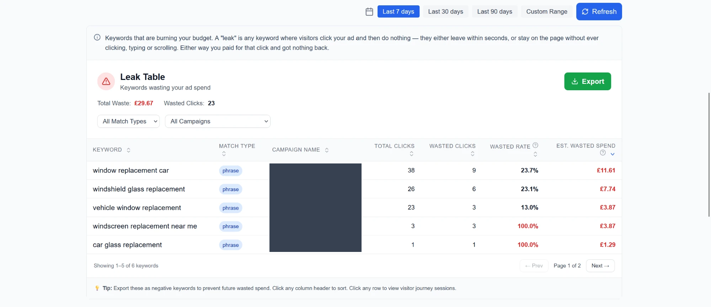

Groups sessions by keyword and match type, and prices the wasted ones using the
per-session CPC, falling back to the campaign average where a session has none.
Summing cost per session rather than multiplying at the end keeps a keyword that
ran at two different CPCs on one row instead of silently splitting it in two.
*SQL aggregation with window functions, Azure SQL, React table with server-side
sorting, filtering and pagination.*

**All sessions — every ad visit and what came of it**

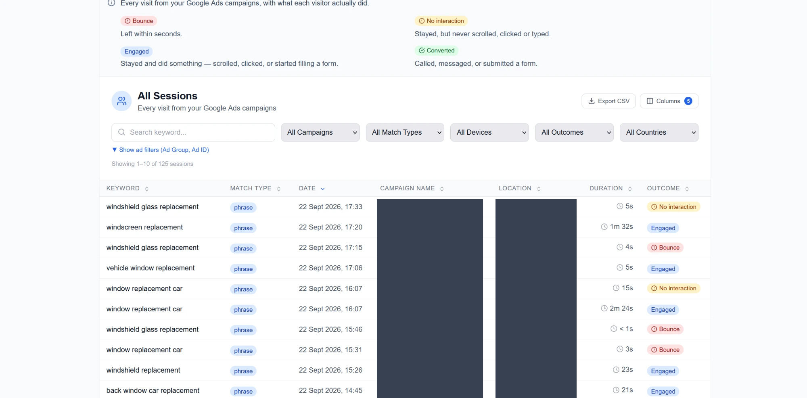

Four outcomes: bounced, no interaction, engaged, converted. "No interaction"
exists because a visitor who stays 40 seconds without scrolling, clicking or
typing was previously counted as engaged, which flattered the numbers. The rule
is shared by the table, the journey view, the CSV export and the weekly email so
one visit can never be labelled two different ways.
*TypeScript, dynamic SQL filter composition with parameterised queries,
multi-column sorting, CSV streaming export.*

**Weekly report email**

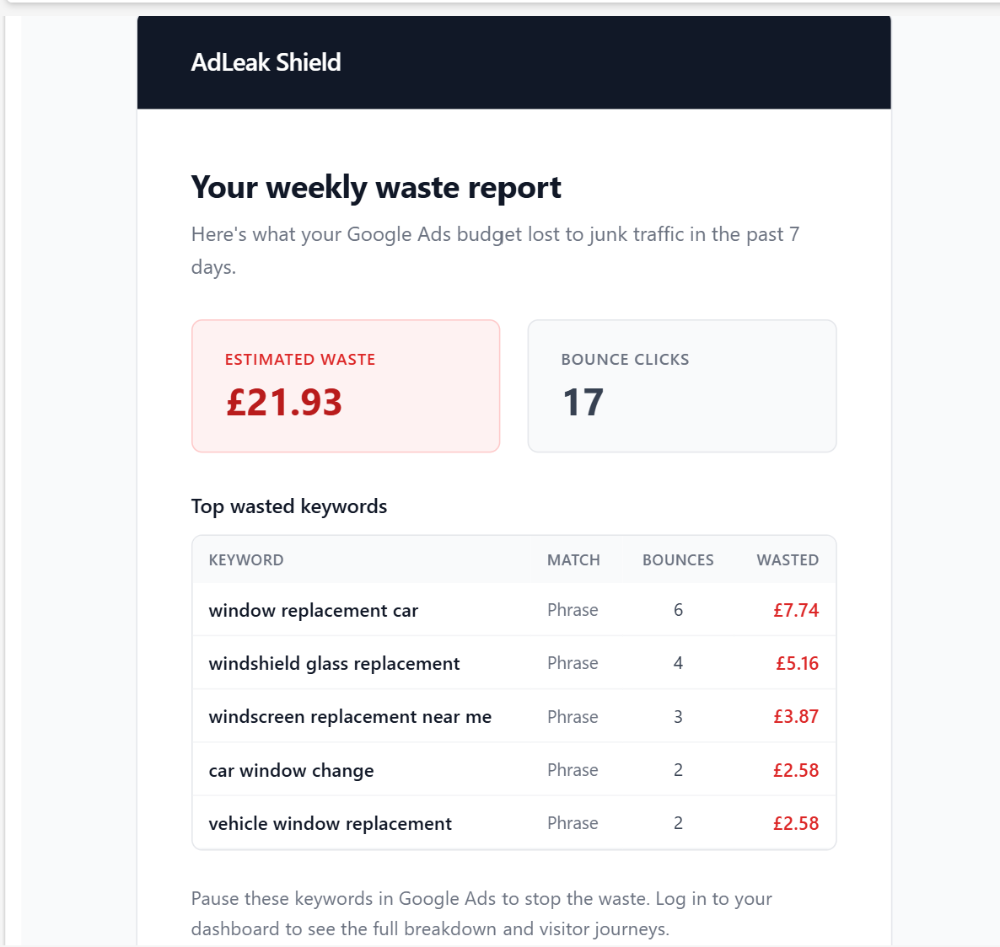

Sent every Monday by a timer-triggered Azure Function that queries each tenant
in turn and renders an HTML email.
*Azure Functions timer trigger, Resend, hand-written responsive HTML email.*

**The same report when there's nothing to report**

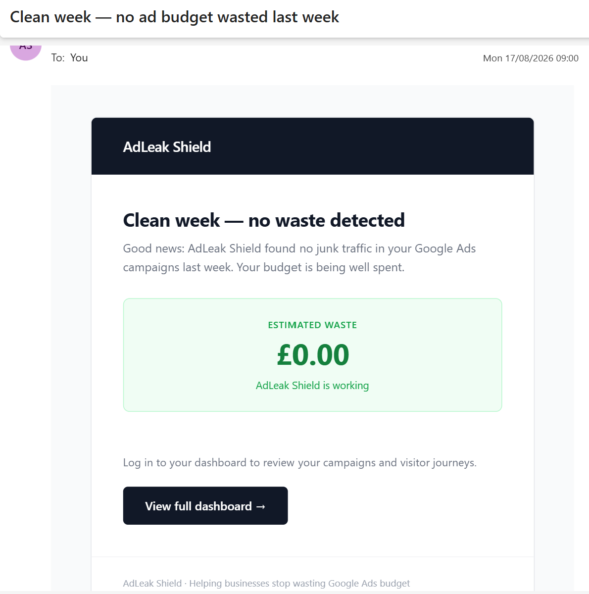

A separate template for a clean week. A product that only ever emails bad news
gets filtered to spam; a weekly "nothing wrong, it's working" is what keeps the
subscription feeling alive.

### Onboarding and installation

**Step 1 — register the domain**

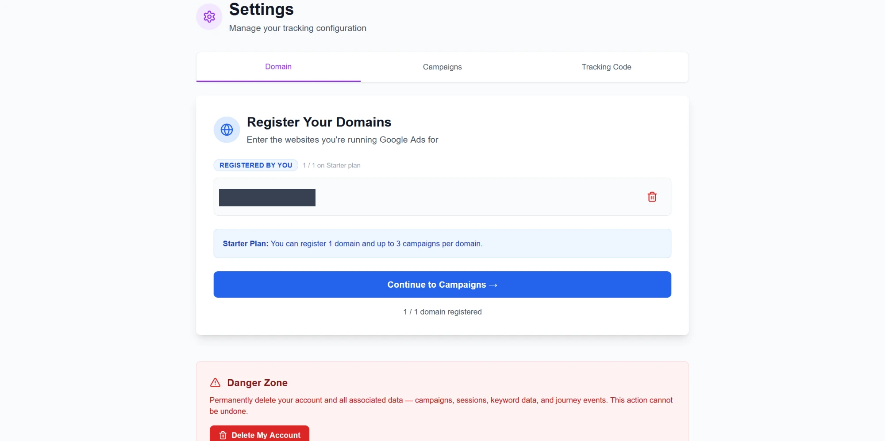

Plan limits are enforced here and again server-side.
*Next.js App Router, NextAuth sessions, plan-based authorisation.*

**Step 2 — register campaigns**

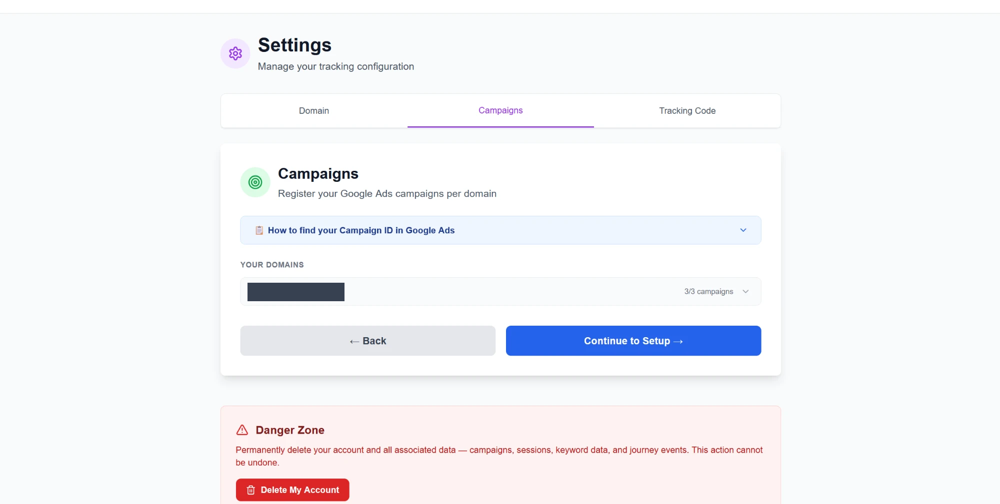

Campaign IDs registered up front are what lets the ingestion worker reject
traffic that doesn't belong to a paying tenant.

**Step 3 — install the snippet and the Google Ads tracking template**

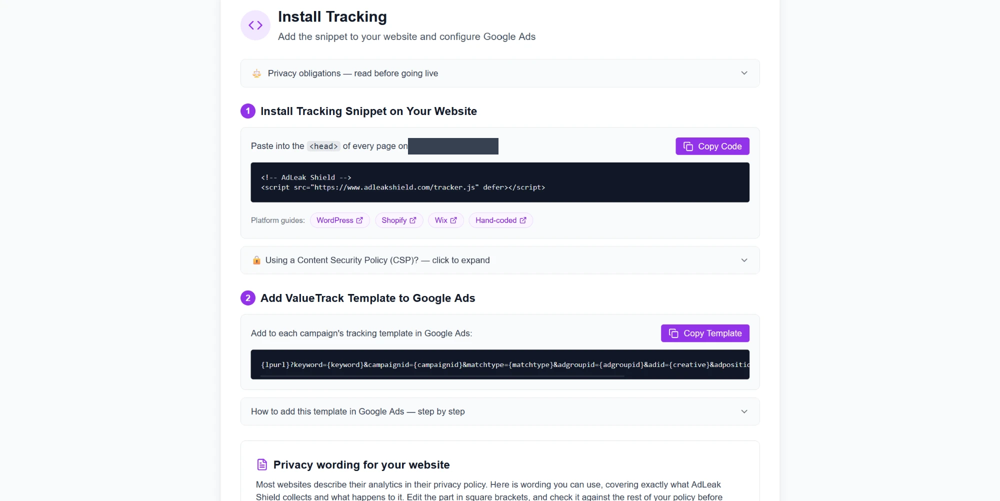

Generates the ValueTrack template that makes Google append the keyword, match
type, campaign, ad group and click ID to every ad click, with per-platform
install guides for WordPress, Shopify, Wix and hand-coded sites, plus the CSP
directives a site with a Content Security Policy needs.
*Google Ads ValueTrack parameters, Subresource Integrity, Content Security
Policy, clipboard API.*

**Verified installation, not assumed**

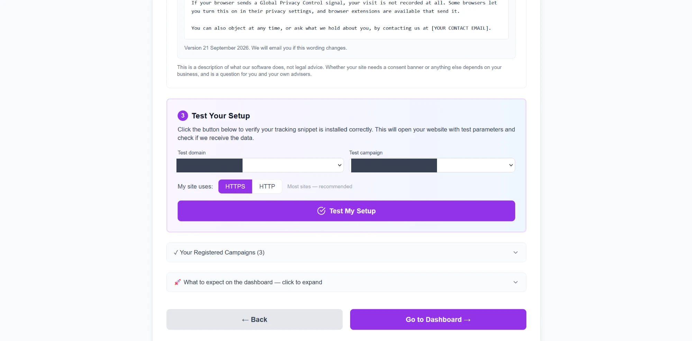

Opens the customer's own site with test parameters, then checks whether the data
actually arrived. It turns "did I paste that in the right place?" into a button,
and a failed install surfaces immediately instead of as a support email a week
later.
*End-to-end verification loop across browser, Function, queue and database.*

**Team access with roles**

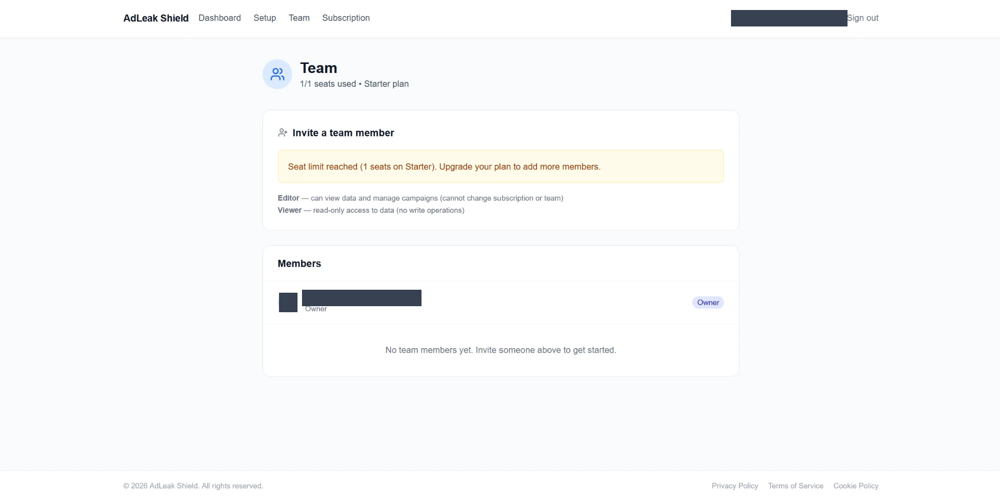

Editor and viewer roles, seat limits per plan, and invitations by email token.
*Role-based access control, single-use hashed invite tokens, row-level security
scoped to the inviting tenant.*

### Subscription lifecycle

**Trial ending**

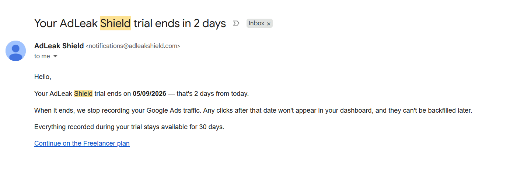

**Trial ended**

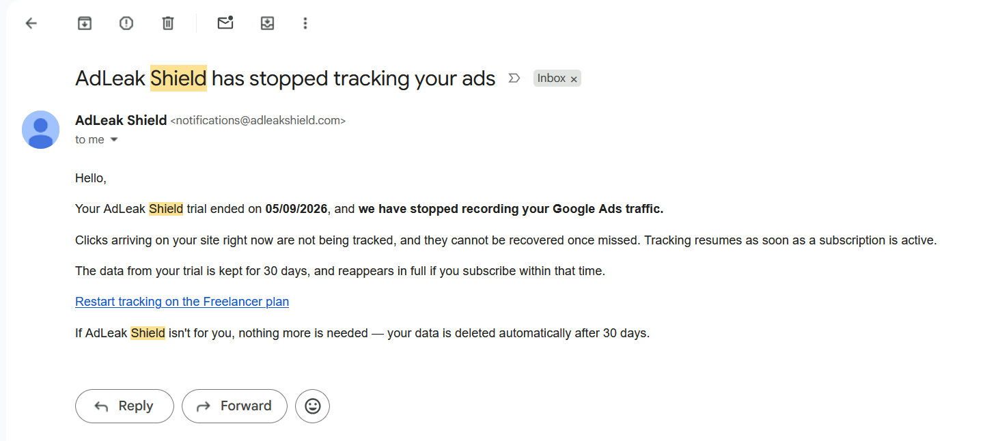

Both are sent by an Azure Logic App on a daily recurrence. It calls a stored
procedure that returns only the tenants due an email, sends through Resend, then
writes a timestamp back so a retry or an overlapping run cannot email the same
person twice.
*Azure Logic Apps, managed identity with EXECUTE-only database permissions,
idempotent workflow design.*

